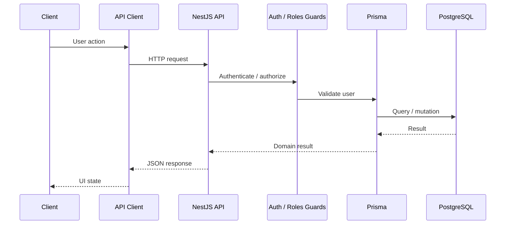

# Architecture

Vellbase is a monorepo with three application surfaces and reusable shared packages.

```text
vellum-monorepo/
├── apps/
│   ├── admin-dashboard/
│   ├── web-app/
│   └── mobile-app/
├── packages/
│   ├── api/
│   ├── api-client/
│   ├── auth/
│   ├── react-hooks/
│   ├── shared-i18n/
│   ├── social-store/
│   └── utils/
├── scripts/
├── tests/
└── .github/workflows/
```

## Runtime flow



## Authentication boundary

The documented flow accepts an access-token cookie or Bearer token, validates the JWT, checks the active user through Prisma, then applies role authorization. The role order is `GUEST < USER < CREATOR < MODERATOR < ADMIN`.

## Infrastructure

- PostgreSQL + Prisma for primary relational data
- Redis for supporting cache/infrastructure use
- File/upload handling for media
- GitHub Actions for CI/CD and database workflows
- Vercel for documented web/admin deployment paths
- Docker-oriented API deployment

## Architecture principles

1. Keep domain responsibilities inside API modules.
2. Reuse client behavior through shared packages.
3. Centralize authentication behavior.
4. Keep operational controls in the admin application.
5. Treat webhooks and bot automation as explicit integration boundaries.
6. Keep secrets in environment configuration, not source.
