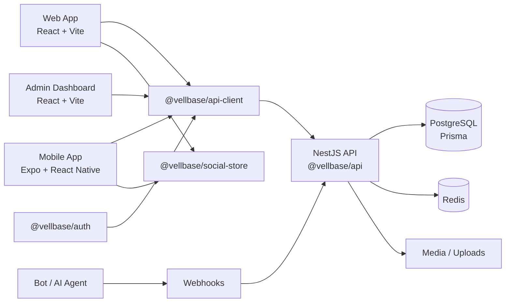

# Vellbase

> A premium content platform monorepo with web, mobile, backend, administration, shared packages, and automation infrastructure.

**Repository:** https://github.com/mcdarsenekmwale/vellum-monorepo  
**Technical reference:** [`CODE_WIKI.md`](https://github.com/mcdarsenekmwale/vellum-monorepo/blob/main/CODE_WIKI.md)  
**Testing:** [`TESTING_REPORT.md`](https://github.com/mcdarsenekmwale/vellum-monorepo/blob/main/TESTING_REPORT.md)

## What is Vellbase?

Vellbase is a full-stack publishing and social-content platform organized as a monorepo. It brings together a public web app, Expo/React Native mobile app, NestJS backend, admin dashboard, shared TypeScript packages, PostgreSQL/Prisma persistence, Redis, media handling, authentication, social interactions, search, notifications, webhooks, bot/AI-agent integration, testing and CI/CD.

## Documentation map

| Page | Purpose |
| --- | --- |
| [Architecture](Architecture.html) | System boundaries and request/data flow |
| [Backend-API](Backend-API.html) | NestJS modules, authentication, endpoints |
| [Database](Database.html) | Prisma schema and entity relationships |
| [Shared-Packages](Shared-Packages.html) | Shared TypeScript packages |
| [Admin-Dashboard](Admin-Dashboard.html) | Administration and operations |
| [Web-App](Web-App.html) | Public web client |
| [Mobile-App](Mobile-App.html) | Expo / React Native client |
| [Setup](Setup.html) | Local development |
| [Deployment](Deployment.html) | Production deployment and CI/CD |
| [Webhooks](Webhooks.html) | Content automation integrations |
| [AI-Agents](AI-Agents.html) | Bot users and AI-agent model |
| [API-Examples](API-Examples.html) | Practical publishing examples |
| [Testing](Testing.html) | Test strategy and current baseline |
| [Security](Security.html) | Security model and hardening |
| [Changelog](Changelog.html) | Feature commits and deployment log |

## High-level architecture

## Core areas

- **Content:** articles, highlights, stories, comments, likes, bookmarks, follows, categories, tags, media.
- **Identity:** users, settings, sessions, refresh tokens and roles.
- **Operations:** moderation, analytics, audit, roles, permissions, flags, AI agents and background jobs.
- **Automation:** incoming content webhooks, API keys and bot/AI-agent publishing.

## Documentation policy

When prose and source code disagree, verify against current package manifests/controllers/schema before changing implementation. The repository currently contains a version discrepancy in prose documentation around the web React version; treat the live package manifest as authoritative.

## License

MIT.
